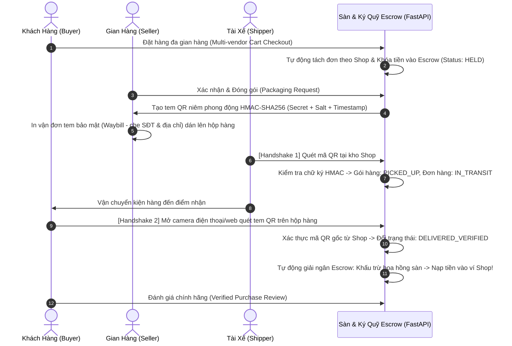

# SECURE MULTI-VENDOR E-COMMERCE PLATFORM
## End-to-End Anti-Tamper Packaging & Escrow Verification System

> **Dự án Mẫu Đầy Đủ (Full-Stack Prototype)** giải quyết triệt để vấn nạn **tráo ruột kiện hàng trong chuỗi cung ứng**, **lừa đảo đơn hàng COD**, và **rò rỉ dữ liệu cá nhân** thông qua công nghệ mã hóa tem QR động (HMAC-SHA256), giao thức xác thực 4 bên (4-Party Role Handshake), và cơ chế tự động giải ngân ký quỹ Escrow.

---

## 1. TỔNG QUAN KIẾN TRÚC & CƠ CHẾ BẢO MẬT

Hệ thống kết nối 4 tác tử thông qua chu trình bảo mật khép kín:



---

## 2. PHÂN BỔ 10 TIỂU DỰ ÁN CHO THÀNH VIÊN TRONG NHÓM

Hệ thống được thiết kế theo kiến trúc **Modular Monolith**, mỗi module có thư mục riêng biệt giúp các thành viên nhóm làm việc độc lập mà không bị xung đột code:

| Module | Tên Module & Chức Năng | Thư Mục Phụ Trách | File Chính Cần Chỉnh Sửa |
|---|---|---|---|
| **Module 1** | **Quản trị định danh & Bảo mật RBAC** (JWT, Bcrypt, Middleware phân quyền 4 role) | `app/modules/auth/` | `router.py`, `dependencies.py` |
| **Module 2** | **Quản lý gian hàng & Mã hóa xuất kho** (CRUD sản phẩm, tem QR động HMAC-SHA256) | `app/modules/shop/` | `router.py`, `service.py` |
| **Module 3** | **Ứng dụng giao vận cho Shipper** (Danh sách lấy hàng, Handshake 1 quét nhận kho) | `app/modules/shipper/` | `router.py`, `service.py` |
| **Module 4** | **Phân hệ nhận hàng an toàn cho Khách** (Live tracking, Handshake 2 quét QR camera) | `app/modules/buyer/` | `router.py`, `service.py` |
| **Module 5** | **Xử lý giỏ hàng & Vòng đời đơn hàng** (Giỏ đa shop, thuật toán tách sub-order) | `app/modules/order/` | `router.py`, `service.py` |
| **Module 6** | **Thanh toán & Ký quỹ tạm giữ** (Escrow lock `HELD`, tự động giải ngân vào ví Shop) | `app/modules/escrow/` | `router.py`, `service.py` |
| **Module 7** | **Tra cứu sản phẩm & Bảo mật thông tin** (Geo-distance Haversine, che SĐT/địa chỉ Waybill) | `app/modules/discovery/`| `router.py`, `privacy.py` |
| **Module 8** | **Quản lý khiếu nại & Cảnh báo lừa đảo** (Đóng băng Escrow, Fraud Score, trọng tài Admin) | `app/modules/dispute/` | `router.py`, `service.py` |
| **Module 9** | **Đánh giá & Phản hồi sau mua** (Guardrail chặn đánh giá ảo, chỉ cho phép khi DELIVERED_VERIFIED) | `app/modules/review/` | `router.py`, `service.py` |
| **Module 10**| **Bảng điều khiển quản trị toàn sàn** (KPI GMV, hoa hồng, Safe Delivery Rate %, Audit Log) | `app/modules/admin/` | `router.py`, `service.py` |

---

## 3. TÀI KHOẢN DÙNG THỬ (PRE-CONFIGURED TEST ACCOUNTS)

Mật khẩu chung cho tất cả các tài khoản thử nghiệm: **`Password123!`**

| Vai Trò | Email Đăng Nhập | Tên Hiển Thị | Quyền Hạn |
|---|---|---|---|
| 👑 **Admin** | `admin@ecommerce.vn` | Quản Trị Viên Hệ Thống | Giám sát toàn sàn, giải quyết khiếu nại, xem Audit Log |
| 🏪 **Shop 1** | `shop1@techstore.vn` | TechStore Official Hà Nội | Đăng bán, xuất kho, tạo tem QR niêm phong, rút tiền ví |
| 🏪 **Shop 2** | `shop2@fashionhub.vn` | FashionHub Sài Gòn | Gian hàng thời trang phụ kiện |
| 🚚 **Shipper** | `shipper@fastship.vn` | Lê Văn Shipper (FastShip) | Quét QR nhận hàng tại kho (Handshake 1), giao hàng |
| 🛒 **Buyer** | `buyer@customer.vn` | Phạm Thị Khách Hàng (VIP) | Mua sắm, quét QR nhận hàng (Handshake 2), đánh giá |

---

## 4. HƯỚNG DẪN CÀI ĐẶT & CHẠY ỨNG DỤNG

### Bước 1: Kích hoạt môi trường ảo Python
Môi trường ảo đã được tạo sẵn tại thư mục dự án:
```powershell
# Kích hoạt venv trên Windows PowerShell:
.\venv\Scripts\Activate.ps1
```

*(Nếu cài đặt trên máy mới, chỉ cần chạy: `python -m venv venv` và `pip install -r requirements.txt`)*

### Bước 2: Nạp dữ liệu mẫu ban đầu (Seed Data)
Chạy script để khởi tạo các bảng CSDL, tạo tài khoản và các đơn hàng mẫu đang ở các trạng thái khác nhau:
```powershell
python seed_data.py
```

### Bước 3: Khởi động Web Server
Chạy máy chủ FastAPI / Uvicorn:
```powershell
python run.py
```
Hoặc dùng lệnh uvicorn trực tiếp:
```powershell
uvicorn app.main:app --host 127.0.0.1 --port 8000 --reload
```

### Bước 4: Mở giao diện trên trình duyệt
- **Giao diện Web Portal người dùng & điều khiển đa vai trò**: [http://localhost:8000](http://localhost:8000)
- **Tài liệu API Swagger UI**: [http://localhost:8000/docs](http://localhost:8000/docs)
- **Tài liệu API ReDoc**: [http://localhost:8000/redoc](http://localhost:8000/redoc)

---

## 5. HƯỚNG DẪN TRẢI NGHIỆM ĐẦY ĐỦ CHU TRÌNH TEST (E2E WALKTHROUGH)

Tại thanh điều hướng trên cùng của trang web, bạn có thể **bấm chuyển đổi nhanh 1-click** giữa 4 vai trò:

### Kịch bản A: Xác thực nhận hàng thành công & Giải ngân ký quỹ tự động
1. Bấm chọn vai trò **`🛒 Khách Hàng (Buyer)`**:
   - Chuyển sang tab **"📦 Đơn Hàng & Xác Thực QR"**.
   - Bạn sẽ thấy đơn hàng **#2** đang ở trạng thái `🚚 IN_TRANSIT (Đang Đi Giao Tới Bạn)`.
   - Bấm nút **"Xác Thực Nhận Hàng & Giải Ngân Tiền Cho Shop"** hoặc bấm **"Quét Mã QR Nhận Hàng (Camera)"** (có thể dùng camera điện thoại/laptop hoặc bấm *⚡ Điền mã đơn hàng test*).
   - **Kết quả ngay lập tức**: Hệ thống kiểm tra chữ ký HMAC-SHA256, chuyển trạng thái đơn hàng sang `DELIVERED_VERIFIED`.
   - Tiền ký quỹ tự động khấu trừ 5% hoa hồng sàn và chuyển 2,156,500đ thẳng vào ví của Shop!

2. Bấm chọn vai trò **`🏪 Gian Hàng (Shop)`**:
   - Bạn sẽ thấy **Số Dư Ví Gian Hàng** đã lập tức tăng lên tương ứng với số tiền vừa được giải ngân!
   - Xem đơn hàng **#1** đang ở trạng thái `Chờ Đóng Gói`.
   - Bấm **"Đóng Gói & Xuất Tem QR Chống Tráo Hàng"** -> Mã QR mật được sinh ra kèm nút **"Xem Tem Vận Đơn"** cho phép in nhãn dán bưu kiện với SĐT đã che bảo mật (`091****678`).

3. Bấm chọn vai trò **`🚚 Tài Xế (Shipper)`**:
   - Đơn hàng **#1** vừa đóng gói sẽ xuất hiện trong danh sách **"Kiện Hàng Chờ Lấy Tại Kho Shop"**.
   - Bấm **"Quét Nhận Hàng (Handshake 1)"** -> Hệ thống kiểm tra mã tem và chuyển đơn hàng sang trạng thái `IN_TRANSIT`.

4. Bấm chọn vai trò **`👑 Quản Trị Sàn (Admin)`**:
   - Xem tổng quan các chỉ số tài chính thời gian thực: Tổng GMV sàn, Doanh thu hoa hồng đã thu, Tỷ lệ giao hàng an toàn qua QR (100%).
   - Xem bảng **Nhật Ký Kiểm Toán (Immutable Audit Trail)** ghi nhận đầy đủ từng sự kiện sinh tem, quét nhận kho, quét giao hàng và giải ngân ký quỹ.

### Kịch bản B: Phòng chống gian lận & Đóng băng ký quỹ khi có khiếu nại
1. Với tư cách Khách Hàng, tại một đơn hàng đang giao hoặc nhận, bấm **"Khiếu Nại Tráo Hàng / Hỏng Tem"**.
2. Chọn lý do: *"Nghi vấn tráo ruột kiện hàng"* và nhập ghi chú.
3. Bấm gửi:
   - Sàn lập tức **ĐÓNG BĂNG TIỀN KÝ QUỸ** (Escrow chuyển sang `DISPUTED`).
   - Shop và Shipper liên đới bị tăng điểm cảnh báo gian lận (`fraud_score`).
4. Chuyển sang vai trò **`👑 Quản Trị Sàn (Admin)`**:
   - Vào tab **"Quản Lý Khiếu Nại & Trọng Tài Escrow"**.
   - Admin kiểm tra chứng cứ và bấm **"Hoàn Tiền Cho Khách"** (Escrow `REFUNDED`) hoặc **"Đánh Dấu Lừa Đảo"**.

---

## 6. KIỂM THỬ TỰ ĐỘNG (AUTOMATED TEST SUITE)

Để chạy kiểm thử tự động toàn diện kiểm tra tính đúng đắn của toàn bộ 10 module:
```powershell
python test_system_flow.py
```
Kết quả kiểm thử kiểm tra toàn bộ luồng: Đăng nhập 4 role, tính khoảng cách địa lý, giỏ hàng đa shop, xuất tem QR, Handshake 1, Handshake 2, giải ngân ví, chặn đánh giá ảo và xử lý khiếu nại!
